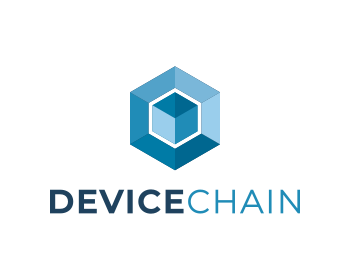

<p align="center">
  <picture>
    <source media="(prefers-color-scheme: dark)" srcset="branding/logos/logo.svg">
    
  </picture>
</p>

**A modern, cloud-native IoT Application Enablement Platform built in Go and React.**

[](LICENSE)

DeviceChain™ connects, manages, and processes data from large, heterogeneous device
fleets — covering device lifecycle, telemetry ingestion, command & control,
organizational modeling, and multi-tenancy — and exposes everything through a
GraphQL API.

It is a ground-up rebuild of the [SiteWhere](https://github.com/sitewhere/sitewhere) IoT platform
that keeps the proven domain model while replacing the heavy Java/Spring stack with
efficient, operationally simple microservices that run on any Kubernetes cluster.
The goal is a self-hosted, full-featured platform that is operationally simple,
architecturally complete, and **unmetered all the way to production scale**.

> **Project status:** DeviceChain is pre-release and under active development. The
> documentation marks each capability as **available**, **planned**, or **in
> design**, and this repository is the source of truth for what currently builds
> and runs.

## Why DeviceChain

- **Go-native microservices** — sub-second startup, a small memory footprint, and
  single-binary services per functional area.
- **Operator + CRDs, not shell scripts** — a Kubernetes operator reconciles a
  declarative `Instance` custom resource, so an instance's deployment shape is
  version-controllable and GitOps-friendly.
- **GraphQL-first API** — introspectable and self-documenting; no generated client
  stubs and no REST surface to maintain.
- **A lean, fully open-source stack** — NATS JetStream is the entire messaging /
  MQTT / KV backbone, native JWT handles auth, TimescaleDB is the single data
  store, and OpenTofu provisions infrastructure. **Two dependencies to run
  locally: NATS + TimescaleDB.** No Java, Keycloak, Kafka, ZooKeeper, Redis, or
  Mosquitto.
- **A uniform relationship model** — device context is a typed relationship graph
  rather than rigid assignments, so new entity types compose without schema churn.
- **Self-hosted and unmetered** — Apache-2.0 with no open-core split and no
  per-device pricing. Device inventory, twin state, command delivery,
  multi-tenancy, high availability, and SSO are part of the open platform, not a
  paid tier. Run it inside your own environment with full data ownership.

## Open source, all the way down

DeviceChain ships under **Apache License 2.0 with no open-core split**. There is no
proprietary "Enterprise" edition that gates production-critical capability —
clustering / high availability, multi-tenant isolation, persistent command
delivery, and SSO are all part of the open stack, as are roadmapped capabilities
like OTA updates when they land. Nothing production-critical is reserved for a
paid tier.

Every runtime dependency is **OSI-approved** open source (Apache 2.0, MIT, BSD, MPL
2.0), and nothing in the stack is encumbered by a source-available or
business-source license. Because the platform runs entirely inside your own
environment, the data — and the compliance boundary around it — stays with you:
no third-party processor to vet and full source auditability.

## Standards and interoperability

DeviceChain favors open, widely-implemented standards over bespoke protocols, so
existing tools and off-the-shelf device clients work without a special SDK:

- **Device transport** — devices connect over standard **MQTT** (the built-in NATS
  MQTT server on port 1883); HTTP, CoAP, and WebSocket transports are planned. Any
  conformant MQTT client works unchanged.
- **Edge ingestion** — a dedicated adapter ingests **[Eclipse Sparkplug B](https://sparkplug.eclipse.org/)**
  by joining your existing Sparkplug MQTT environment as a Host Application, so
  brownfield edge fleets stream in without changing anything on the device side. It
  also drives **authoritative device presence** — online/offline taken from the
  Sparkplug birth/death handshake rather than inferred from an activity timeout.
- **API** — **GraphQL** for all external APIs (one introspectable schema per
  service). Internal service-to-service communication is asynchronous over NATS.
- **Authentication** — native **RS256 JSON Web Tokens** (RFC 7519) with a
  standard **JWKS** endpoint and RFC 7638 key thumbprints for rotation. Device
  credentials are pluggable, including **X.509** certificates and access tokens.
  user-management also runs a standards-based **OAuth 2.1** authorization server
  (PKCE, RFC 8414 metadata, RFC 8707 audience-bound tokens) that secures MCP
  access.
- **Enterprise SSO (optional)** — an optional [Dex](https://dexidp.io) sidecar
  adds **OIDC / SAML / LDAP** without a heavyweight identity provider per tenant.
- **Observability** — **Prometheus** metrics, and Kubernetes-standard `/healthz`
  (liveness) and `/readyz` (readiness) probes on every service.
- **Orchestration & IaC** — runs on any **CNCF-conformant** Kubernetes cluster
  (EKS, GKE, AKS, K3s, kind), packaged with **Helm**, with infrastructure
  provisioned by **OpenTofu** (a Terraform-compatible, Linux Foundation project).
- **Data** — **PostgreSQL** + **TimescaleDB**: a single SQL engine for both
  relational entity data and time-series events.

## Architecture

DeviceChain is a set of stateless Go microservices over a shared core library,
coordinated by a Kubernetes operator and connected by NATS JetStream. A **single
instance serves all tenants** (a shared-microservice model); tenant isolation is
enforced at the messaging and storage layers rather than by running separate pods
per tenant.

### Core services

| Service | Responsibility |
|---|---|
| **event-sources** | Inbound device transports. Decodes raw messages and publishes them onto the pipeline. |
| **sparkplug-ingest** | An opt-in, stateful [Eclipse Sparkplug B](https://sparkplug.eclipse.org/) Host Application: connects out to per-tenant customer brokers, runs the Sparkplug session machine, maps `{group}/{node}[/{device}]` identities to devices, and feeds the same pipeline — the first transport to assert authoritative device presence. Leader-elected so exactly one replica connects. |
| **device-management** | Devices, device types + versioned device profiles, the typed relationship graph, alarm objects (level-state integration), and event resolution. |
| **event-management** | Persists resolved events to TimescaleDB and serves time-series queries over GraphQL. |
| **user-management** | Identities, per-tenant memberships, roles, and two-tier JWT issuance / validation (JWKS). |
| **device-state** | Live last-known-state projection per device (presence, latest location and measurements). |
| **command-delivery** | Persistent, two-way command dispatch to devices. |
| **dashboard-management** | Stores tenant dashboard definitions; the embeddable widget packages render live telemetry over them. |
| **notification-management** | Routes triggered alarms to humans — per-tenant policy over email (SMTP) and webhook, with per-severity escalation. |
| **event-processing** | The DETECT + REACT pipeline and the sole alarm engine: taps the resolved-events stream, detects conditions over a keyed-streaming CEL core, and dispatches actions (raise-alarm, send-command, and outbound connectors). Rules are authored on the profile as forms or on a visual automation canvas. |
| **outbound-connectors** | Delivers REACT's outbound actions to external systems — an HTTP/webhook `httpCall` and a `publish` to MQTT, Kafka, AWS SNS, and AWS SQS — over a tenant-scoped, versioned connector whose credentials live in the secret store. Isolated from the detection engine in its own process. |
| **ai-inference** | An opt-in service that drafts a detection rule from a natural-language description and hands it to the same compiler humans use — the AI proposes, the compiler disposes, and it never sits in the replay-correct path. Providers are operator-registered with write-only API-key handles; external-model use is per-tenant opt-in and fail-closed, and the model a tenant runs is a tiered entitlement. |
| **mcp** | An opt-in OAuth 2.1 Resource Server exposing read-only tools (devices, state, telemetry, alarms, commands) to AI agents over the Model Context Protocol, fronting the per-area GraphQL under the caller's own token. |
| **operator** | A controller-runtime operator reconciling the `Instance` custom resource (an instance's deployment shape). |

### The backbone

- **NATS JetStream** is the single backbone for asynchronous messaging, the MQTT
  ingress, and key-value caching / locking — no separate Kafka, Redis, or MQTT
  broker.
- **TimescaleDB** (PostgreSQL + the TimescaleDB extension) is the single data
  store for both relational entity data and time-series events. Events live in
  hypertables with compression and continuous aggregates.

### The event pipeline

```
device → MQTT/NATS → event-sources → (decoded event)
       → device-management → (resolved event: device + relationship context attached)
       → event-management → TimescaleDB
```

During resolution, device-management looks up the device's **tracked**
relationships and denormalizes them onto each event as index dimensions, so
downstream queries like "every reading for Building 7" resolve without joins.

### Deployment model

Infrastructure (NATS, TimescaleDB, ingress, TLS) is provisioned by **OpenTofu** at
cluster-creation time. The **operator** assumes that infrastructure exists and is
responsible only for materializing DeviceChain workloads and maintaining their
configuration — keeping cluster bootstrapping out of application code.

Each service loads its configuration into a typed schema and **fails closed**: an
unknown key, a wrong type, or an invalid value is rejected at startup rather than
silently ignored. Secrets a service must hold (channel credentials, connector
auth) are kept in a pluggable **secret store** — envelope-encrypted in Postgres
under an instance root key by default, with external managers (Vault, cloud KMS)
as drop-in backends — and are referenced by handle rather than stored in the clear.

## Running locally

`dcctl` — the platform CLI — bootstraps a complete instance with one command. It
is self-contained: the operator manifests, Helm chart, and OpenTofu config are
embedded in the binary, so no source checkout, `kubectl`, `helm`, or `kustomize`
is required. The single host prerequisites are **Docker**, **kind**, and
**OpenTofu** (the CLI's preflight checks guide you through any that are missing).

```bash
# Stand up a full instance on a local kind cluster at http://localhost/
dcctl bootstrap local --host localhost --no-tls

# …then open the printed console URL and log in with the seeded credentials.

# Tear it all back down (use --keep-cluster to uninstall only the instance)
dcctl destroy
```

The bootstrap pipeline renders config → `tofu apply` (NATS + TimescaleDB + ingress)
→ installs the CRDs/operator → `helm install`s the instance → seeds the initial
superuser → waits for readiness → reports the access URL — and is idempotent on
re-run. It defaults to published images; pass `--build` for the from-source
(ko → local registry) developer path. Building `dcctl` itself: `cd backend/cli &&
make build`.

> Because DeviceChain is pre-release, no image tags have been published yet — use
> the `--build` path until the first release is cut.

## Domain model

DeviceChain models the physical world with a small set of composable concepts. The
defining choice is that device *context* is expressed as a **typed relationship
graph** rather than a fixed assignment record:

- **Device** — the thing that connects and reports; an instance of a device type.
- **Device Type** — the taxonomy/identity layer: name, appearance (icon/colors),
  and classification. A type references at most one device profile.
- **Device Profile** — a distinct, **versioned** (draft / publish / rollback)
  capability aggregate that owns a device class's **metric**, **command**, and
  **alarm-rule** definitions. Many types can share one profile, and a device
  resolves its capabilities through `device → type → profile`.
- **Asset** — the real-world thing a device monitors (Device / Person / Hardware).
- **Area** — a spatial/organizational location, optionally with polygon boundaries
  and zones; areas nest into hierarchies.
- **Customer** — an organizational owner; customers also nest into hierarchies.
- **Groups** — one uniform **entity group** collects any of the above with either
  **static** membership (an explicit list) or **dynamic** membership — a CEL
  selector over the members' attributes (e.g. `attr["climate"] == "arid"`),
  resolved on read as an indexed query, so the group stays current as attributes
  change.

Entities are addressed uniformly by **entity type + id**, and connected by
**typed, directed relationships**. A relationship type carries a `Tracked` flag
that selects which relationships are denormalized onto events for indexing — so a
device can relate to many customers, areas, assets, or even other devices at once,
and context can evolve without schema migrations.

DeviceChain also distinguishes **current state** from **history**: append-only
**events** in TimescaleDB hypertables, versus key-value **attributes** in three
scopes — `CLIENT` (device-reported), `SERVER` (platform-only), and `SHARED`
(platform-set, device-readable; the channel for remote config and OTA). Attributes
double as **classification facets**: a per-tenant registry declares which attribute
keys are browse/filter axes, and those same attributes are what a dynamic group's
selector matches on — one primitive, no separate tag store.

## Multi-tenancy

A single shared set of microservices serves all tenants. Isolation is enforced
where it matters:

- **Storage** — every tenant-owned row carries a `tenant_id`, and a central,
  **fail-closed** database scope applies a `WHERE tenant_id = …` predicate to every
  read and stamps it on every write. A tenant-scoped query with no tenant in
  context is rejected.
- **Messaging** — subjects are scoped per tenant (`{instance}.{tenant}.{suffix}`).
- **Auth** — a person is a global, email-keyed **identity** that holds one
  **membership** per tenant. Logging in yields an **identity token** (admin API);
  selecting a tenant exchanges it for a single-tenant **tenant token** that drives
  the data plane. The per-request tenant comes from that verified tenant token's
  claim; the per-message tenant is derived from the messaging subject.

Adding a tenant is a control-plane operation — the superuser creates it through the
admin API / console (an `iam_tenants` record), not a Kubernetes resource. Tenants
do **not** get their own pods.

An operator packages what a tenant gets through a first-class **tenant tier** — an
operator-defined, sold-not-tuned entity (gold / silver / bronze, or whatever an
operator names) that subsystems *read* but never redefine: it supplies the per-tenant
governance ceilings a tenant inherits and the AI models a tenant may use. A shed dial
is tuned; a tier is sold. Tiers, priority, and limits are never client-settable and
never a token claim.

## Tech stack

| Area | Choice |
|---|---|
| **Backend** | Go 1.26+ (Go Workspaces), `net/http` + graph-gophers/graphql-go, GORM |
| **Frontend** | TypeScript, React 19 (hooks), Vite, TailwindCSS, shadcn/ui, GraphQL Code Generator (client-preset) |
| **Messaging / KV / MQTT** | NATS JetStream |
| **Data** | PostgreSQL 17+ with TimescaleDB Community Edition |
| **Auth** | Native RS256 JWT + JWKS; optional Dex for OIDC/SAML/LDAP |
| **Orchestration** | Kubernetes (controller-runtime operator), Helm |
| **Infrastructure as Code** | OpenTofu |
| **Observability** | Prometheus, zerolog |

Minimum to run locally: a NATS server (a single ~10MB binary) and TimescaleDB
(via Docker). No Java, Keycloak, Kafka, ZooKeeper, Redis, or Mosquitto.

## Repository layout

```
backend/    Go monorepo (Go Workspaces)
  core/       shared library — entity, auth, messaging, config, rdb, graphql
  services/   microservices — device-management, user-management, event-management,
              event-sources, device-state, command-delivery, dashboard-management,
              notification-management, event-processing, outbound-connectors,
              ai-inference, mcp
  k8s/        Kubernetes operator (controller-runtime)
  cli/        dcctl — instance bootstrap / destroy and admin tooling
frontend/   npm workspace — apps/console (React + TypeScript management console)
            + packages (client SDK, dashboard runtime, embeddable widgets)
deploy/     Helm chart + OpenTofu modules
docs/       Docusaurus documentation site
```

## Documentation

The [`docs/`](docs/) directory is a Docusaurus site covering concepts
(architecture, domain model, multi-tenancy), deployment, and guides. See
[`docs/docs/intro.md`](docs/docs/intro.md) to start.

## License

DeviceChain is licensed under the **Apache License 2.0**. See [LICENSE](LICENSE)
and [NOTICE](NOTICE). Copyright is held by **The DeviceChain Authors**.

"DeviceChain" and the DeviceChain logo are trademarks of **IoT Innovations, LLC**
(U.S. application pending, USPTO Serial No. 99910096). The Apache 2.0 license
covers the code, not the Marks — see [TRADEMARK.md](TRADEMARK.md) for the
trademark policy.
