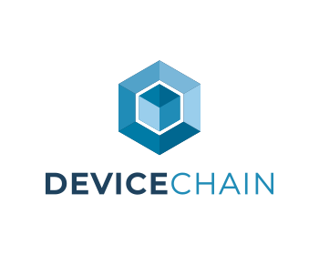

<p align="center">
  <picture>
    <source media="(prefers-color-scheme: dark)" srcset="branding/logos/logo.svg">
    
  </picture>
</p>

**An open-source, self-hosted IoT platform for collecting device telemetry, detecting conditions in it and sending commands back, on Kubernetes.**

[](LICENSE)
[](https://github.com/devicechain-io/devicechain/releases/latest)
[](https://artifacthub.io/packages/search?repo=devicechain)
[](https://scorecard.dev/viewer/?uri=github.com/devicechain-io/devicechain)

DeviceChain has not reached 1.0. A release can change APIs and schemas, and each one lists its
breaking changes first ([Status](#status)).

DeviceChain™ takes in telemetry from device fleets, keeps a record of each device and the assets,
areas and customers it belongs to, detects conditions in the data as it arrives, and sends
commands back. One installation serves many tenants. It is meant for teams that build an IoT
product or run a fleet and want to run the platform in a Kubernetes cluster they control, with
their data kept there. All of it is Apache 2.0 and in this repository, including high
availability, multi-tenancy and command delivery; there is no paid edition.

## What it does

### Ingest

Devices send data over these transports:

- MQTT, through the broker built into NATS (port 1883)
- HTTP, as a `POST` of a JSON event (the same body a device publishes over MQTT)
- [Eclipse Sparkplug B](https://docs.devicechain.io/concepts/sparkplug), with DeviceChain joining
  your existing Sparkplug broker as a Host Application
- [OMA LwM2M](https://docs.devicechain.io/concepts/lwm2m) over CoAP/UDP with DTLS

The transports differ in what they support. HTTP is ingest only, Sparkplug devices cannot be
commanded, and LwM2M telemetry is decoded from SenML-JSON only. Sparkplug and LwM2M are not in
the default install; add them at bootstrap with `--enable-area sparkplug-ingest` or
`--enable-area lwm2m-ingest`. The
[transport matrix](https://docs.devicechain.io/reference/transport-matrix) lists what each one
does and what it lacks.

### Device model

You describe a kind of device once, in a versioned device profile that lists its metrics,
commands and detection rules. Publishing a new profile version changes the behaviour of every
device of that type in one step, and rollback undoes it. Devices can be linked to assets, areas
and customers. The links you mark as tracked are written onto each event when it arrives, so a
query for everything in one building finds its readings without walking the relationship graph,
and history stays where it was when a device is moved. See the
[domain model](https://docs.devicechain.io/concepts/domain-model).

### Detection and alarms

Detection rules run in the event-processing service as events arrive. Condition types include
thresholds, conditions held for a duration, repeated occurrences, rate of change, silence,
connectivity, windowed aggregates and conditions met by several devices in one area. A rule can
raise an alarm, send a command to a device, call a webhook, or publish to MQTT, Kafka, AWS SNS or
AWS SQS. The webhook and publish actions need the `outbound-connectors` area, which is off by
default. Rules are written as forms, on a visual canvas that can replay history against a draft,
or from a plain-language description when the optional AI service is enabled. Alarms reach people
by email or webhook, with escalation. See
[event processing and alarms](https://docs.devicechain.io/concepts/event-processing).

### Commands and dashboards

Commands are validated against the device's profile, then tracked until the device reports the
result or the command's time-to-live runs out
([commands](https://docs.devicechain.io/concepts/commands)). Dashboards are versioned per tenant
and render with React widget packages published to npm, which you can embed in your own
application ([dashboards](https://docs.devicechain.io/concepts/dashboards)).

### APIs and data access

The management and query APIs are GraphQL, and their schemas are published in the docs
([schema index](https://docs.devicechain.io/schema/index.json)). Introspection is off in a running
instance. Client libraries are the `@devicechain/client` TypeScript package on npm and the
`DeviceChain.Sdk` .NET package on NuGet, which also targets Unity. Telemetry lives in TimescaleDB,
so BI tools and `psql` can read it through a read-only analytics schema
([SQL and BI access](https://docs.devicechain.io/guides/sql-and-bi-access)). An optional
[MCP server](https://docs.devicechain.io/concepts/mcp) gives AI assistants read-only access to a
tenant, under the signed-in user's own token.

## How it runs

DeviceChain is a set of Go services on Kubernetes, with a React console. NATS JetStream carries
messaging, device MQTT connections and key-value state. PostgreSQL holds entity data, and a
second PostgreSQL database with the TimescaleDB extension holds events. Each tenant's data is
separated by a tenant column that every query is scoped to, and by per-tenant messaging subjects.
All tenants share one set of services
([multi-tenancy](https://docs.devicechain.io/concepts/multi-tenancy)).

A default install is sized for one tenant sending at the default ingest limit of 1,000 messages a
second, one reading per message. At that rate `device-management` uses about one CPU core and
`event-management` about half of one. More tenants at their limits, or messages that carry many
readings, need more ([service sizing](https://docs.devicechain.io/deployment/bootstrap#service-sizing)).

The `--ha` flag on `dcctl install` runs the message broker as a three-node cluster with every
stream replicated, and both databases as three-instance clusters. It needs three schedulable
nodes (on kind, three workers). An `--ha` install keeps running when any one node is lost; a
second node lost at the same time stops writes. `dcctl ha verify` checks that the broker holds
the replication the install declares ([high availability](https://docs.devicechain.io/deployment/bootstrap#ha)).

The [disaster recovery](https://docs.devicechain.io/deployment/disaster-recovery) page covers
backups and restore. A restore covers the two databases; JetStream stream state and object
storage have not been through a restore drill.

DeviceChain started as a rebuild of the [SiteWhere](https://github.com/sitewhere/sitewhere) IoT
platform. It begins from SiteWhere's domain (devices, device types, assets, areas and customers)
and replaces the Java and Spring stack with Go services. There is no tool to import data from a
SiteWhere installation.

## Status

DeviceChain has not reached 1.0, and until it does any release may change APIs, schemas or
behaviour without a compatibility period. Each release lists its breaking changes first, in the
[release notes](https://github.com/devicechain-io/devicechain/releases) and the
[upgrade guide](https://docs.devicechain.io/deployment/releases-and-upgrades). Read them before
you upgrade.

`dcctl install local` and `dcctl bootstrap local` are tested end to end on kind. To use another
cluster, pass `--kube-context <ctx>` to both commands; that path is not part of the end-to-end
tests.

## Install

`dcctl` is the command-line tool that installs and runs DeviceChain. Download it for Linux, macOS
or Windows from the [releases page](https://github.com/devicechain-io/devicechain/releases). It
carries the Helm chart, the operator manifests and the OpenTofu configuration inside it, so the
binary is all you need from this repository. It drives these tools, which must be on your `PATH`:

- `docker`
- `kubectl`
- `helm`
- OpenTofu (`tofu`) or `terraform`
- `kind`, for the local provider

The cluster must run Kubernetes 1.29 or newer. `dcctl preflight local` checks the tools, and the
Kubernetes version once a cluster exists, without changing anything. For a small machine,
[`--compact`](https://docs.devicechain.io/deployment/bootstrap#--compact) on `dcctl install`
lowers resource requests and leaves out the monitoring stack.

`dcctl install` prepares a Kubernetes cluster once. `dcctl bootstrap` then creates an instance:
one DeviceChain deployment with its own console, message broker and databases. Tenants are
created inside an instance.

```bash
# Prepare the cluster. This creates a kind cluster named "devicechain" if there is none, and
# installs the DeviceChain operator, a shared PostgreSQL server and its backup store, the
# CloudNativePG operator, cert-manager, Prometheus and Grafana, and ingress-nginx.
dcctl install local

# Create an instance served at http://localhost/.
dcctl bootstrap local devicechain --host localhost --no-tls
```

Bootstrap prints the console URL and a generated password for `superuser@devicechain.local`.
[Your first device](https://docs.devicechain.io/quickstart/first-device) continues from here. It
walks you through creating a tenant, sending a reading with `curl` and seeing it in the console.

To remove the instance, run `dcctl destroy local devicechain`. The cluster and what
`dcctl install` put on it stay; `kind delete cluster --name devicechain` removes them. Destroy
keeps the instance's root-key escrow file. Move it aside before you bootstrap again under the
same name.

To build `dcctl` from source, run `make build` in `backend/cli`. A binary you build yourself has
no default image version, so pass `--build` to both commands to build the images from source
(this needs `ko`), or `--version vX.Y.Z` to deploy a published release.

## Documentation

The documentation is at [docs.devicechain.io](https://docs.devicechain.io). Its source is in
[`docs/`](docs/). Good places to start:

- [Your first device](https://docs.devicechain.io/quickstart/first-device)
- [Connecting a device](https://docs.devicechain.io/guides/connecting-a-device)
- [GraphQL API](https://docs.devicechain.io/reference/graphql-api)
- [Releases and upgrades](https://docs.devicechain.io/deployment/releases-and-upgrades)
- [Local development](https://docs.devicechain.io/guides/local-development), for working on the
  source
- [`llms.txt`](https://docs.devicechain.io/llms.txt), an index of the docs for AI assistants

## Getting help and contributing

Ask questions and propose ideas in
[Discussions](https://github.com/devicechain-io/devicechain/discussions). Report bugs through
[issues](https://github.com/devicechain-io/devicechain/issues/new/choose), which have short forms
for install failures, missing telemetry and docs problems. A rough report of where you got stuck
is still useful. Report security vulnerabilities privately to
[admin@devicechain.io](mailto:admin@devicechain.io) (see [SECURITY.md](SECURITY.md)).

To contribute code, read [CONTRIBUTING.md](CONTRIBUTING.md). Contributors sign a CLA before a
change can be merged.

## License

DeviceChain is licensed under the [Apache License 2.0](LICENSE) (see also [NOTICE](NOTICE)).
Copyright is held by The DeviceChain Authors.

"DeviceChain" and the DeviceChain logo are trademarks of IoT Innovations, LLC. The Apache 2.0
license covers the code, not the marks. See [TRADEMARK.md](TRADEMARK.md) for the trademark policy.
